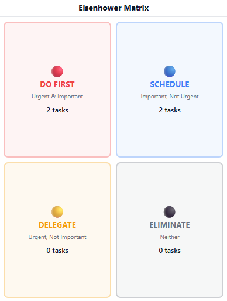
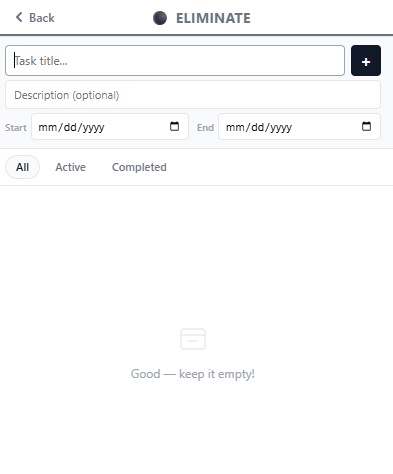

<div align="center">
  

  # Eisenhower Matrix

  **A dead-simple Chrome extension to prioritize your tasks like a CEO.**

  Stop drowning in bloated to-do apps. Drop a task into one of four boxes and get on with your day.
</div>

---

## Why this exists

Most productivity apps are overkill. Accounts, syncing, tags, projects, sub-tasks, integrations, onboarding flows — you spend more time managing the app than doing the work.

This extension was built around a single idea: **make prioritizing tasks as simple as humanly possible.** No sign-up. No cloud. No clutter. Open it from your toolbar, type a task, pick where it belongs. That's the whole thing.

It's based on the **Eisenhower Matrix**, a decision method attributed to U.S. President Dwight D. Eisenhower: sort everything by how *urgent* and how *important* it is, then act accordingly.

## What it does

The matrix splits your tasks into four quadrants:

| Quadrant | Meaning | What to do |
| --- | --- | --- |
| 🔴 **Do First** | Urgent & Important | Handle these now |
| 🔵 **Schedule** | Important, Not Urgent | Plan time for them |
| 🟡 **Delegate** | Urgent, Not Important | Hand them off |
| ⚫ **Eliminate** | Neither | Drop them |

<div align="center">
  
  <br />
  <em>The home screen — four quadrants, live task counts, one click to open any of them.</em>
</div>

Click a quadrant to open it, and you get a clean task list for that priority level:

<div align="center">
  
  <br />
  <em>Inside a quadrant — add a task with an optional description and start/end dates, then filter by All, Active, or Completed.</em>
</div>

### Features

- ✅ **Four-quadrant prioritization** based on urgency and importance.
- ✍️ **Quick add** — title, plus an optional description and start/end dates.
- 🔀 **Right-click a task** to move it to another quadrant or edit it.
- ☑️ **Filter** each quadrant by All, Active, or Completed.
- 💾 **Saved locally** with Chrome storage — your tasks persist, no account needed.
- 🔒 **Private by design** — nothing leaves your browser.

## Install it

This extension isn't on the Chrome Web Store — it loads straight from the built files in a few clicks.

**Prerequisite:** [Node.js](https://nodejs.org/) 18+ installed (which includes `npm`). That's the only thing you need beyond Chrome.

1. **Download this repo** — click the green **Code** button → **Download ZIP**, then unzip it (or `git clone` it).
2. **Build it** (one time):
   ```bash
   npm install
   npm run build
   ```
   This creates a `dist/` folder containing the extension.
3. **Open Chrome** and go to `chrome://extensions`.
4. **Turn on Developer mode** (toggle in the top-right corner).
5. Click **Load unpacked** and select the **`dist/`** folder.
6. Pin the icon to your toolbar and you're done — click it anytime to open your matrix.

> **Tip:** After pulling new changes, run `npm run build` again and hit the refresh icon on the extension card in `chrome://extensions`.

## How to use it

1. Click the toolbar icon to open the matrix.
2. Click a quadrant (e.g. **Do First**).
3. Type a task title, optionally add a description and dates, and press **+**.
4. Check tasks off when done, or **right-click** to move or edit them.

That's it. No tutorial required.

## Built with

- [React](https://react.dev/) + [Vite](https://vitejs.dev/)
- [@crxjs/vite-plugin](https://crxjs.dev/) for the Chrome extension build
- Chrome Manifest V3 with local `storage`

## License

Free to use and modify.

---

Made by **Panagiotis Komninos**.
